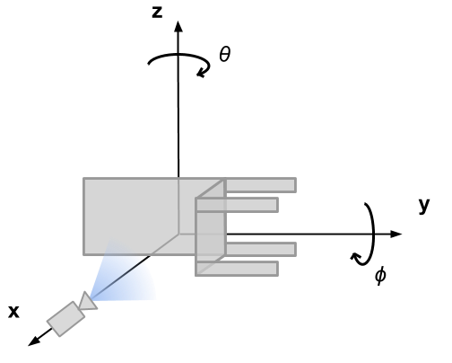

# Equivariant Neural Rendering

This repo contains code to reproduce all experiments in [Equivariant Neural Rendering](https://arxiv.org/abs/2006.07630) by [E. Dupont](https://emiliendupont.github.io), [M. A. Bautista](https://scholar.google.com/citations?user=ZrRs-qoAAAAJ&hl=en), [A. Colburn](https://www.colburn.org), [A. Sankar](https://scholar.google.com/citations?user=6ZDIdEAAAAAJ&hl=en), [C. Guestrin](https://homes.cs.washington.edu/~guestrin/), [J. Susskind](https://scholar.google.com/citations?user=Sv2TGqsAAAAJ&hl=en), [Q. Shan](http://shanqi.github.io), ICML 2020.


### Pre-trained models

The weights for the trained chairs model are provided in `trained-models/chairs.pt`. 

The other pre-trained models are located https://icml20-prod.cdn-apple.com/eqn-data/models/pre-trained_models.zip.  They should be downloaded and placed into the trained-models directory.  A small model chairs.pt is included in the git repo.

## Examples


## Requirements

The requirements can be directly installed from PyPi with `pip install -r requirements.txt`. Running the code requires `python3.6` or higher.

## Datasets

- ShapeNet chairs: https://icml20-prod.cdn-apple.com/eqn-data/data/chairs.zip
- ShapeNet cars: https://icml20-prod.cdn-apple.com/eqn-data/data/cars.zip
- MugsHQ: https://icml20-prod.cdn-apple.com/eqn-data/data/mugs.zip
- 3D mountains: https://icml20-prod.cdn-apple.com/eqn-data/data/mountains.zip
 

each zip file will expand into 3 separate components and a readme e.g:
- `cars-train.zip`
- `cars-val.zip`
- `cars-test.zip`
- `readme.txt` containing the license terms.

A few example images are provided in `imgs/example-data/`.
 
The chairs and car datasets were created with the help of [Vincent Sitzmann](https://vsitzmann.github.io).
 
Satellite imagery © 2020 Maxar Technologies.

We thank Bernhard Vogl (salzamt@dativ.at) for the lightmaps.  The MugsHQ were rendered utilizing an environmental map located at http://dativ.at/lightprobes. 

## Usage

### Training a model

To train a model, run the following:

```
python experiments.py config.json
```

This supports both single and multi-GPU training (see `config.json` for detailed training options). Note that you need to download the datasets before running this command.

### Quantitative evaluation

To evaluate a model, run the following:

```
python evaluate_psnr.py <path_to_model> <path_to_data>
```

This will measure the performance (in PSNR) of a trained model on a test dataset.

### Model exploration and visualization

The jupyter notebook `exploration.ipynb` shows how to use a trained model to infer a scene representation from a single image and how to use this representation to render novel views.


## Coordinate system

The diagram below details the coordinate system we use for the voxel grid. Due to the manner in which images are stored in arrays and the way PyTorch's `affine_grid` and `grid_sample` functions work, this is a slightly unusual coordinate system. Note that `theta` and `phi` correspond to elevation and azimuth rotations of the **camera** around the scene representation. Note also that these are left handed rotations. Full details of the voxel rotation function can be found in `transforms3d/rotations.py`.



## Citing

If you find this code useful in your research, consider citing with

```
@article{dupont2020equivariant,
  title={Equivariant Neural Rendering},
  author={Dupont, Emilien and Miguel Angel, Bautista and Colburn, Alex and Sankar, Aditya and Guestrin, Carlos and Susskind, Josh and Shan, Qi},
  journal={arXiv preprint arXiv:2006.07630},
  year={2020}
}
```

## License

This project is licensed under the Apple Sample Code License

